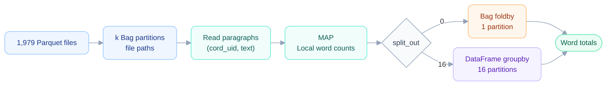

# WORD COUNT — SPEECH

I’ll start by explaining the computational pipeline of the word count, and then I’ll discuss the benchmarks.

## Computational pipeline

### 1. Prepare the input

`paragraph_files()` collects the file paths and sorts them by numerical partition index. `split_evenly` divides them into **k groups of approximately equal size**. With `partition_size=1`, each group becomes one Bag partition, giving exactly **k input partitions**.

**Dask is lazy:** at this stage, we build the computational graph. The Bag initially contains file paths; actual reading happens when the computation is triggered. `load_group`, applied with `map_partitions`, reads only `cord_uid` and `text`, producing `(cord_uid, text)` pairs.

### 2. Map: count locally

`document_counts` runs independently on each partition. It creates a `Counter` for each document and updates it with the words in that document’s paragraphs within the partition.

The output is `((cord_uid, word), count)`. **Counting is local to the partition, with no communication between workers during this step.**

### 3. Reduce: aggregate by word

| Step | `split_out = 0` | `split_out = 16` |
|---|---|---|
| Preparation | Keep the Map output in a Bag | Use `word_and_count` to flatten records to `(word, count)` |
| Aggregation | Bag `foldby`, grouped by word | Convert to DataFrame; group by `word` and sum `count` |
| Combining counts | `add_count` for local counts; `operator.add` for partial results | Distributed aggregation using the `tasks` shuffle method |
| Final output | Bag with **1 partition** | Convert back to Bag with **16 partitions** |
| Performance implication | Final aggregation becomes a bottleneck | Final aggregation remains distributed |

For the DataFrame branch, removing `cord_uid` gives two regular columns, `word` and `count`. The pipeline explicitly uses **task-based shuffle** for the Bag-to-DataFrame computation.

## BENCHMARKS

| Cluster resource | Configuration |
|---|---|
| Scheduler | 1 machine |
| Worker machines | 4 machines |
| Resources per worker machine | 4 CPU cores, about 7.1 GB RAM |
| Total available worker CPU cores | 16 |

**Worker machines and worker processes are different:** the same four machines can host different numbers of Dask worker processes.

**Workers vs threads.** A Dask worker is a separate Python process, with its own Python interpreter and GIL. Threads inside the same worker share the same process and therefore the same GIL.

This is important because our Map phase contains a lot of Python-level work, such as loops, dictionaries, Counters and text processing.

For this kind of CPU-heavy Python work, threads inside the same process cannot efficiently execute Python bytecode in parallel because of the GIL.

Separate worker processes can, because each process has its own GIL.

## BENCHMARK 1 — NUMBER OF PARTITIONS

In the first benchmark, we vary the number of input partitions k.

The dataset is always the same and split_out is always equal to 16.

We compare four cluster configurations:

| Worker processes | Threads per worker | Total threads | GIL scope |
|---:|---:|---:|---|
| 4 | 1 | 4 | One GIL per process |
| 4 | 4 | 16 | Four threads share each process’s GIL |
| 8 | 1 | 8 | One GIL per process |
| 16 | 1 | 16 | One GIL per process |

*Runtime versus number of partitions. Crosses indicate runs that failed with KilledWorker.*

| Partition setting | Effect | Observed consequence |
|---|---|---|
| Small `k` | Large partitions; high memory per task | Smallest values can cause `KilledWorker` errors |
| `k ≈ 128–256` | Balance between task size and scheduling cost | Best region for 4 workers × 1 thread; about **385 s** at `k = 256` |
| Large `k` | More, smaller tasks | Scheduling overhead increases |

For the configuration with 4 workers and 1 thread per worker, the best region is around 128 to 256 partitions.

At k = 256, runtime is around 385 seconds.

If we increase k further, the runtime starts increasing again because of scheduler overhead.

The 8-worker and 16-worker configurations are much faster once the partitions are small enough to fit in memory.

However, increasing the number of worker processes also means that more processes compete for the RAM available on each machine.

**Key point:** partition count balances task size, RAM usage, scheduler overhead and CPU parallelism.

## BENCHMARK 2 — NUMBER OF WORKERS

In the second benchmark, we isolate the effect of the number of workers.

**Fixed parameters:** `k = 256`, `split_out = 16`.

Then we vary the number of workers from 1 to 4.

We compare **1 thread per worker** with **4 threads per worker**.

*Left: runtime. Right: speedup relative to one worker, compared with ideal scaling.*

| Workers | Threads per worker | Approximate runtime |
|---:|---:|---:|
| 1 | 1 | 1,260 s |
| 2 | 1 | 710 s |
| 3 | 1 | 500 s |
| 4 | 1 | **385 s** |

*The table reports the rounded values from the speech; the graph also shows the campaign with 4 threads per worker.*

With 4 workers, the speedup is about **3.27×**, compared with an ideal speedup of **4×**. Scaling is good, but not perfectly linear.

This is expected because distributed execution introduces communication, scheduling and shuffle overhead.

With 4 threads per worker, the scaling is worse.

This already suggests that increasing the number of independent worker processes is more effective than adding threads inside the same process.

## BENCHMARK 3 — THREADS PER WORKER

**Fixed parameters:** 4 workers, `k = 256`, `split_out = 16`.

The only parameter that changes is the number of threads per worker.

*For this benchmark, focus on the left panel: runtime versus threads per worker.*

| Threads per worker | Workers | Total threads | Approximate runtime |
|---:|---:|---:|---:|
| 1 | 4 | 4 | **385 s** |
| 2 | 4 | 8 | 416 s |
| 4 | 4 | 16 | 516 s |

**Key point:** in this workload, adding more threads makes execution slower.

The reason is that the Map phase is strongly Python-based.

Threads inside the same worker share the same GIL, so they cannot all execute Python bytecode at the same time.

Separate workers, instead, are separate processes and therefore have separate GILs.

This is why process-level parallelism works much better here than multithreading.

Extra threads can still help in operations implemented in C that release the GIL, or during I/O, but for the whole word-count workload the measured effect is negative.

More threads also increase the possibility that several memory-heavy tasks run concurrently inside the same worker.

## BENCHMARK 4 — REDUCE STRATEGY

**Fixed parameters:** 4 workers, 1 thread per worker, `k = 256`.

So the CPU configuration and the Map phase are unchanged.

The only thing we change is the Reduce strategy.

*For this benchmark, focus on the right panel: split_out = 16 versus split_out = 0.*

| `split_out` | Reduce strategy | Output partitions | Approximate runtime |
|---:|---|---:|---:|
| 16 | DataFrame `groupby` + sum | 16 | **385 s** |
| 0 | Bag `foldby` | 1 | **1,212 s** |

The reason is that foldby closes the Reduce into one final partition.

So the computation has a serial bottleneck at the end.

With split_out = 16, instead, the Reduce remains distributed and several tasks can execute in parallel.

So, even with exactly the same workers and CPUs, the structure of the computational graph has a strong effect on performance.

## FINAL MEMORY BENCHMARK

The last benchmark is discussed separately because its main goal is not to study speedup.

Its goal is to explain the KilledWorker failures seen in the partition benchmark.

**Cluster configuration:** 4 workers, 1 thread per worker; vary `k`.

*Peak memory versus number of partitions, with the worker memory limit and failed runs.*

| Plot element | Measurement | Execution context |
|---|---|---|
| Blue curve | Peak RSS memory per worker | Real Dask cluster execution |
| Green curve | Peak memory of one representative partition | `misura_ram.py`: a fresh sequential process, without a Dask cluster |
| Red horizontal line | Worker memory limit: about **7.1 GB** | Reference threshold |

As k decreases, each partition becomes larger.

So one task has to load more files, more paragraphs and more intermediate Python objects.

| Input partitions `k` | Approximate single-task peak memory |
|---:|---:|
| 512 | 0.5 GB |
| 256 | 1 GB |
| 128 | 2 GB |
| 64 | 4 GB |
| 32 | **7.4 GB — above the 7.1 GB worker limit** |

So at k = 32, one task is already around or above the memory available to one worker.

If we reduce k even further, the partitions become even larger and the real cluster runs fail with KilledWorker.

### Closing remarks

The optimal configuration is not simply the one with the largest number of CPUs or threads. Performance depends on the balance between **partition size and memory per task**, **worker processes and threads**, **the Python GIL**, **scheduler overhead**, and **the structure of the Reduce phase**.

---

*Figure source: [result_analysis_word_count.ipynb](/Users/giuliamucci/Downloads/MAPD-Project/Giulia/result_analysis_word_count.ipynb). Figures extracted from the saved notebook outputs.*
