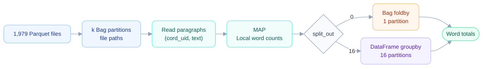

# Word count — Five-minute presentation

*Speaker script · Approximately 5 minutes at a steady presentation pace. Figure cues are not spoken.*

## Introduction and pipeline

I’ll briefly introduce the word-count pipeline, then focus on the benchmarks and what they tell us about performance.

We start with 1,979 Parquet files and divide them into k input partitions. Each partition reads the paragraph text and counts words locally. The Reduce phase then combines these partial counts into global word totals. We compare two strategies: Bag foldby, which ends in one output partition, and a DataFrame aggregation with split_out equal to 16, which keeps the final reduction distributed.

The cluster has four worker machines, each with four CPU cores and about 7.1 gigabytes of RAM. A worker is a Python process, and several workers can run on the same machine. This distinction matters when we compare processes and threads.

## Benchmark 1 — Number of partitions

*Show the partition benchmark.*

First, we vary k while keeping the dataset unchanged and split_out equal to 16. We compare four configurations: four workers with one or four threads each, and eight or sixteen workers with one thread each.

The graph shows a trade-off. With too few partitions, each task processes a large amount of data and needs a lot of memory. The smallest partition counts can therefore cause KilledWorker failures, shown by the crosses.

With too many partitions, tasks become smaller, but the scheduler has more work to manage. For four workers with one thread each, the best region is around 128 to 256 partitions. At 256, execution takes about 385 seconds.

Eight and sixteen worker processes are faster once partitions fit in memory. However, those processes share the RAM on the same four machines. Increasing the worker count therefore also increases competition for memory.

## Benchmark 2 — Number of workers

*Show runtime on the left, then speedup on the right.*

Next, we fix k at 256 and split_out at 16, and vary the worker count from one to four.

With one thread per worker, runtime falls from approximately 1,260 seconds with one worker to 710 with two, 500 with three, and 385 with four.

Four workers give a speedup of about 3.27, compared with an ideal value of four. Scaling is good, although communication, scheduling and shuffle overhead prevent a perfectly linear improvement.

The four-thread configuration scales less effectively, suggesting that separate processes are more useful here than additional threads within each process.

## Benchmark 3 — Threads per worker

*Focus on the left panel.*

The third benchmark tests this directly. We keep four workers, 256 partitions and split_out equal to 16, changing only the threads per worker.

Runtime increases from about 385 seconds with one thread to 416 with two and 516 with four. Adding threads actually makes this workload slower.

The main explanation is the Python-heavy Map phase: loops, dictionaries, Counters and text processing. Threads in one worker share the Python GIL, which limits parallel execution of Python bytecode. Separate processes each have their own GIL.

Threads can help with I/O or operations that release the GIL, but the overall measured effect here is negative.

## Benchmark 4 — Reduce strategy

*Keep the same figure visible and move to the right panel.*

We now keep exactly the same resources: four workers, one thread each and 256 input partitions. Only the Reduce strategy changes.

With split_out equal to 16, runtime is about 385 seconds. With Bag foldby, it rises to approximately 1,212 seconds: more than three times as long.

Foldby brings the final aggregation into one output partition, creating a serial bottleneck. The distributed strategy spreads that final work across multiple partitions. This shows that the computational graph strongly affects performance, even when the available CPUs are unchanged.

## Memory benchmark and conclusion

*Show the memory benchmark.*

Finally, the memory benchmark helps explain the earlier failures. Blue shows peak worker memory during cluster execution; green shows one representative task measured separately, without Dask. The red line marks the 7.1-gigabyte worker limit.

Single-task memory grows from roughly half a gigabyte at 512 partitions to one at 256, two at 128 and four at 64. At 32 partitions, it reaches about 7.4 gigabytes, already above the worker limit.

The conclusion is that performance depends on balancing partition size, memory, worker processes and reduction strategy. For this workload, more threads are less effective than separate processes, and keeping the Reduce distributed is essential.

---

*Figures: [result_analysis_word_count.ipynb](/Users/giuliamucci/Downloads/MAPD-Project/Giulia/result_analysis_word_count.ipynb). Numerical values are rounded as in the original speech.*
