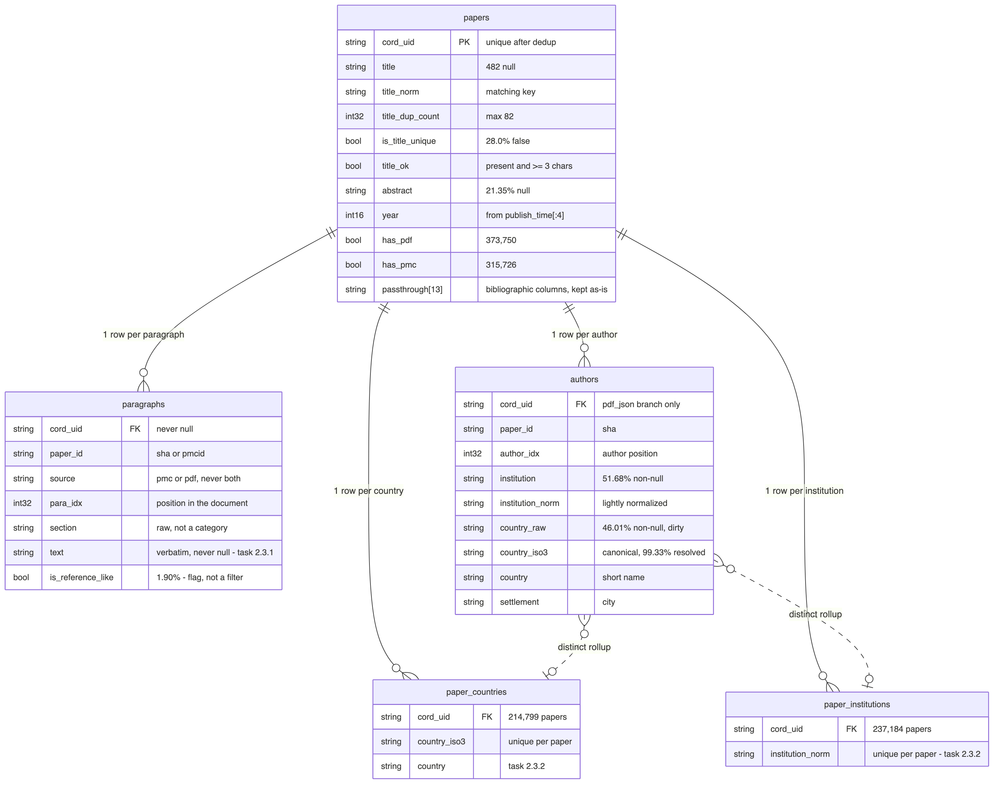

# CORD-19 with Dask

Final project for **MAPD-B** (M.Sc. Physics of Data, University of Padua). The CORD-19
corpus of COVID-19 papers is analysed with **Dask** on a multi-node cluster.

Four tasks:

- **2.3.1** — word count over the text of the papers
- **2.3.2** — most and least represented countries and institutes, from the author affiliations
- **2.3.3** — title embeddings with a pre-trained fastText model
- **2.3.4** — cosine similarity between pairs of titles

Every task is both *run* and *measured*: execution time against the number of partitions,
and against the number of workers.

## Requirements

Python 3.10 or newer, plus:

```
dask[complete]==2026.6.0
distributed==2026.6.0
pandas==2.3.3
numpy==2.2.6
pyarrow==24.0.0
matplotlib==3.10.9
bokeh==3.9.1
asyncssh==2.24.0
notebook==7.6.0
```

```bash
python3 -m venv ~/pyvenv
source ~/pyvenv/bin/activate
pip install -r requirements.txt
```

## The data

The tasks read **Parquet**, not the raw JSON. `conversion_sanification.ipynb` documents
the conversion of the CORD-19 dump into two layers: `bronze/` (a faithful tabular copy of
the JSON) and `silver/` (cleaned and typed — `papers`, `authors`, `paragraphs`), which is
what the tasks read. The Parquet folders are not in the repository: they are tens of GB.

Every script takes the path to the data as its first argument. With no argument it reads
a small sample on a local cluster, which is how a change is tried before occupying the
real one.




## How each task is organised

The four folders follow the same pattern:

| file | what it is |
|---|---|
| `<task>.py` | **the engine**: runs the task once, end to end, from the terminal. `--help` lists its options |
| `bench_<task>.py` | **the campaign**: imports the engine as a module and runs it many times, varying the number of workers, the threads per worker and the number of partitions. One CSV row per measurement |
| `results/*.csv` | the measurements and the outputs those runs produced |
| `*.ipynb` | reads the CSVs, draws the figures and explains the task |

```bash
python Federico/affiliations.py ~/mapd-data/silver/authors --out ~/mapd-out/2_3_2
python Federico/bench_affiliations.py ~/mapd-data/silver/authors --out ~/mapd-out/bench
```

The benchmark scripts are **scaffolding only**: they contain no analysis of their own.
They change how the cluster is started and which arguments the engine receives, then time
it — the algorithm they measure is the same code that runs in the single execution above.

The notebooks explain and plot; they do not compute.

`cluster.py`, at the root, is the only code shared by all four tasks. It starts the Dask
cluster and prints how it is made up (workers, hosts, threads, memory, dashboard address).
**Where the job runs is decided by a file, never by the code**: a `cluster.txt` at the
root holds a comma-separated list of hosts — the first one acts as scheduler only, the
others are workers. Without that file, a local cluster is started on the current machine.
No IP address and no absolute path is written anywhere in the source.

## Folders

| folder | what is in it |
|---|---|
| `Giulia/` | task **2.3.1**, word count — `word_count.py`, `bench_word_count.py`, plus `misura_ram.py` (the extra memory check) |
| `Federico/` | task **2.3.2**, countries and institutes — `affiliations.py`, `bench_affiliations.py` |
| `daniele/` | task **2.3.3**, title embeddings — `title_embeddings.py`, and three campaigns (`bench_scaling.py`, `bench_threads.py`, `bench_knobs.py`) sharing `bench_common.py` |
| `nicco_scripts/` | task **2.3.4**, cosine similarity — `cosine.py`, `bench_cosine.py` |
| `cluster.py` | starts the cluster and prints its configuration |
| `conversion_sanification.ipynb` | the conversion of the raw dump into the Parquet layers |
| `scripts/` | utilities used to download the corpus and set the cluster up |
| `presentation-utility/` | the diagram of the silver schema |

Each task folder has its own README with the details of that task.

## A note on the use of AI

One part of this work was done with the help of an AI assistant (Claude Code), and it is
worth saying which part.

During the **conversion of the raw dump into Parquet** — a preparatory phase, before any
of the four tasks — the workers kept running out of memory on the step that builds
`silver/paragraphs`. As a practical problem it was already solved: the run was completed
with a workaround (writing in blocks, restarting the workers in between), and it could
have been avoided altogether by asking for virtual machines with more RAM. The data in
`data/` are the validated output of that complete run.

What was left was a question rather than a problem: *why* was the memory growing, and
would the same thing come back during the four analyses (where a restart between two
measurements would spoil the benchmark timings)? Answering it meant looking well below our
own code — at how pandas, Arrow and the C allocator handle objects — which is not
something we were in a position to do on our own, so we went through it with Claude Code:
the growth was reproduced locally, on the real data, and traced to a single line of the
transform.

We also checked that it does not come back, instead of assuming it: `Giulia/misura_ram.py`
measures how much memory one word count task needs, outside any cluster. It is an extra
the assignment does not ask for, and what it shows is an ordinary ceiling — the size of a
single task — and nothing of what happened during the conversion.

None of this is required for the assignment and none of it changes a result. The
conversion is a closed phase and is not re-run; the four tasks simply read the Parquet it
produced. We keep the material in the repository for information only:

| file | what it is |
|---|---|
| `scripts/diag_silver_paragraphs.py` | the diagnosis on the cluster: it establishes that worker memory grows, and rules out the usual suspects. A measuring tool, not part of the pipeline |
| `scripts/leaklab.py` | the local reproduction: it replays the same transform on the real data and compares the candidate cures one against the other |
| `scripts/MEMORY_LEAK_REPORT.md` | the report: what was measured, what the cause turned out to be, and what would fix it |
| `Giulia/misura_ram.py` | the check on the word count: the peak memory of a single task, measured outside any cluster. A benchmark of its own, run once |

What this left in the code that actually runs is `configure_memory()` in
`cluster.py` — two allocator settings applied before the workers are started. They came
out of this investigation, they cost nothing, and they are commented as such.
`misura_ram.py` stays as well, but it stands apart from the benchmarks of the four tasks:
no task imports it, nothing depends on it, and it is not re-run.