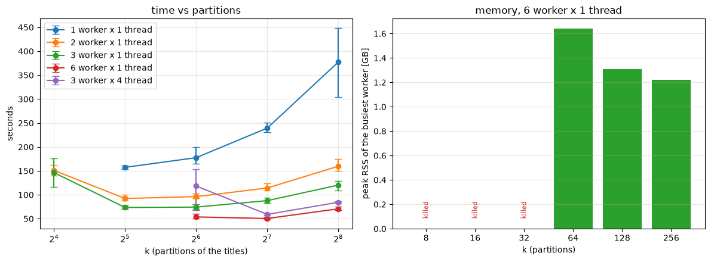
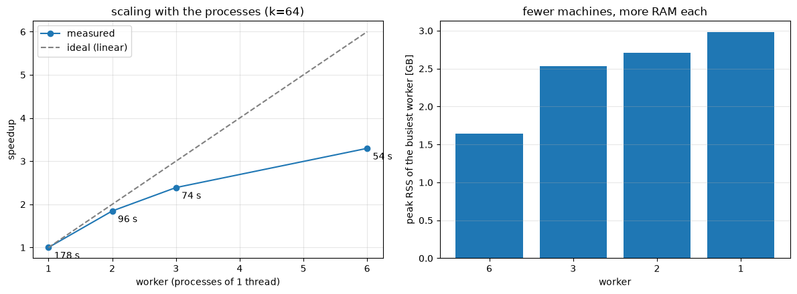
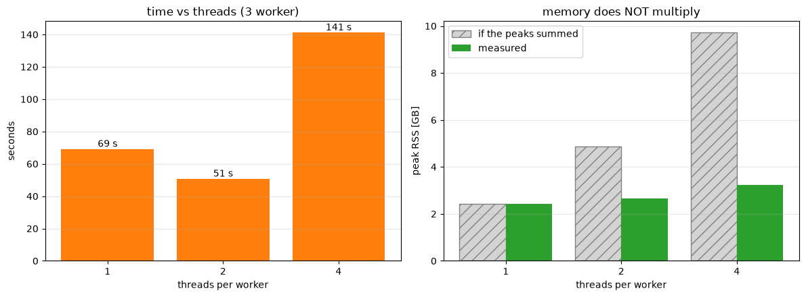
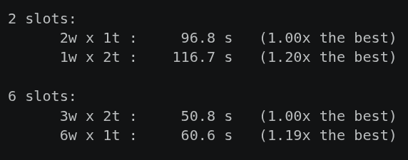
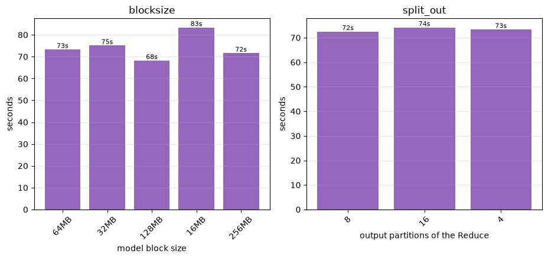

# Task 2.3.3 — Title embeddings

## What the task does

Task 2.3.3: every paper title becomes **one vector of 300 numbers**.

A pre-trained fastText model maps a *word* to a 300-dimensional vector. A title is a
handful of words, so we average them — **mean pooling**. Averaging points of a
300-dimensional space gives another point of the same space, so the vector does not grow
with the title. That fixed size is what 2.3.4 needs: cosine similarity takes two vectors,
not two lists of different length.

But the interesting part is not the average — that is a `groupby` and a division. **It is
the model.** The `.vec` file is **4.5 GB of text**. A worker has **less
than 4 GB of RAM**. So the model is never *loaded*: it is read as a dataset, in blocks, and
thrown away almost entirely. Only the words some title actually uses survive.

## One run, from input to output

```
INPUT  silver/papers                 970,836 papers x 23 cols  (only 3 read)
         │  keep title_ok · findall [a-z]{2,} · explode · drop stop-words
         ▼
(1)    tokens   cord_uid | word              one row per WORD, duplicates kept
         │
         ├──► unique ──► VOCABULARY          161,901 distinct words  (on the driver)
         │                    │  filters the model, block by block
         │                    ▼
         │      model.vec ──► model kept     87,774 x 300 = 0.11 GB
         │      2,000,000 w   64 MB blocks   one copy broadcast to every worker
         │                    │
         └────► JOIN on word ◄┘
                    │
(2)    merged  cord_uid | word | v0..v299    9,020,035 rows x 1.2 kB  ← widest point
                    │  groupby(cord_uid).sum() ÷ n
                    ▼
OUTPUT embeddings  cord_uid | n_words | v0..v299    969,021 rows, 8 parquet parts, 1.07 GB
```

We touch **3 columns out of 23** — Parquet is columnar, the rest never leave the disk.
Tokenise, explode into one row per word.

Now notice: **the vocabulary is a side branch, not the main line.** `tokens` keeps every
occurrence, because to average a title we need to know which paper each word belongs to. The
*distinct* words exist only to filter the model: of two million, **87 thousand survive —
0.11 GB**, small enough to broadcast to every worker.

Then the join — **the widest point of the pipeline**. Every row now carries 300 floats, so
9 million rows weigh about **11 GB**, three times what the cluster has. It only fits because
it is cut into 64 partitions and **never exists all at once**.

969 thousand titles out of 970 get a vector. **52 seconds on three machines.**

## Benchmarks

One rule: **one measure, one brand-new cluster** — a worn worker keeps RSS it no longer
uses. Two numbers: seconds, and **peak RSS of the busiest worker**.

### 1 · Partitions, and the memory wall



Two effects pulling opposite ways. Few partitions, big tasks — the peak of one task goes as
**1/k**, and that is what kills a worker. Many partitions, and the scheduler pays a fixed
cost per task. The minimum is where they cross: **between 32 and 128**.

The right panel is the half people forget. At k = 8, 16, 32 there is **no bar** — not a slow
measure, an **absent** one: the worker was killed. And the wall moves: six processes instead
of three means **half the memory each**, so it shifts *right*.

### 2 · Processes



Same graph, more processes. **178 seconds on one worker, 54 on six** — speedup **3.3×**,
efficiency about **55%**. The gap from the ideal line is what the cluster costs in
coordination and network.

### 3 · Threads



Inside one process now. **Two threads help: 69 down to 51 seconds** — the heavy phase,
parsing 600 million floats, happens in pandas in C and **releases the GIL**, so they
genuinely run together. **Four threads collapse: 141 seconds**, worse than one.

The right panel tests an expectation. Four threads means four tasks inside the **same
process**, sharing **one** memory budget — so you would expect four times the memory of one.
That is the grey bar: the one-thread peak, multiplied by the threads. Nearly **10 GB**.

In green, what actually happened: **3.2**. A task's peak lasts only an instant — when it
holds both the block it just read and the result it is building — and those instants do not
line up. At any moment one task is reading, another is reducing, another is writing. **The
peaks overlap, they do not stack.**

But read the number, not the ratio. **3.2 GB against a budget of 3.5.** Memory did not
multiply — yet it still reached the ceiling, so the worker spills to disk. That is the 141
seconds on the left.

### 4 · The same slots, as processes or as threads



Same concurrency, arranged differently. Six slots as **3 processes × 2 threads: 50.8
seconds**; the same six as **6 × 1: 60.6** — **19% slower**. The threads win, so what four
threads were paying was never the GIL. It was memory.

### 5 · The knobs of this task



Finally, the knobs only this task has. `blocksize` — how the 4.5 GB model is cut — is
**flat across a 16-fold range**, and `split_out` is flat too: neither is the bottleneck.

The result is **what is missing from this figure.** `split_out = 1` has no bar: one task
holding every embedding at once, killed in all three repetitions. The **non-broadcast join**
has no bar either — it never completed once.

So those two decisions are **not optimisations. They are what makes the task finish at
all.** Thank you.
