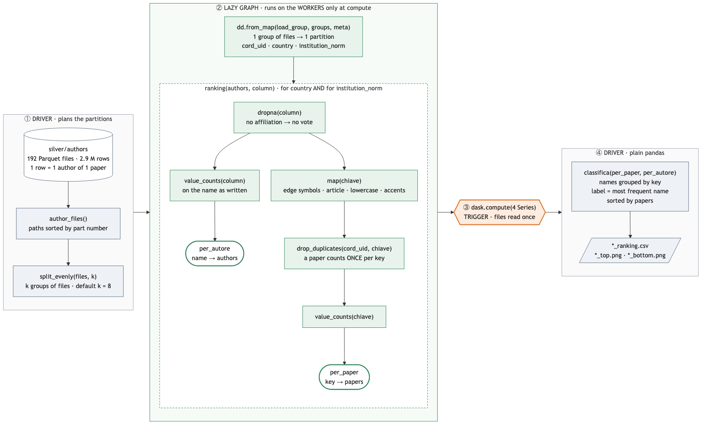
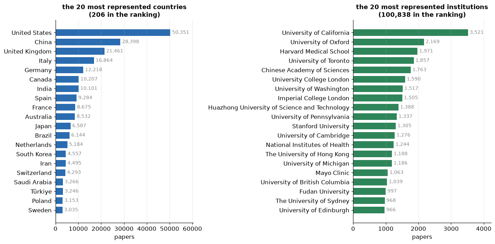
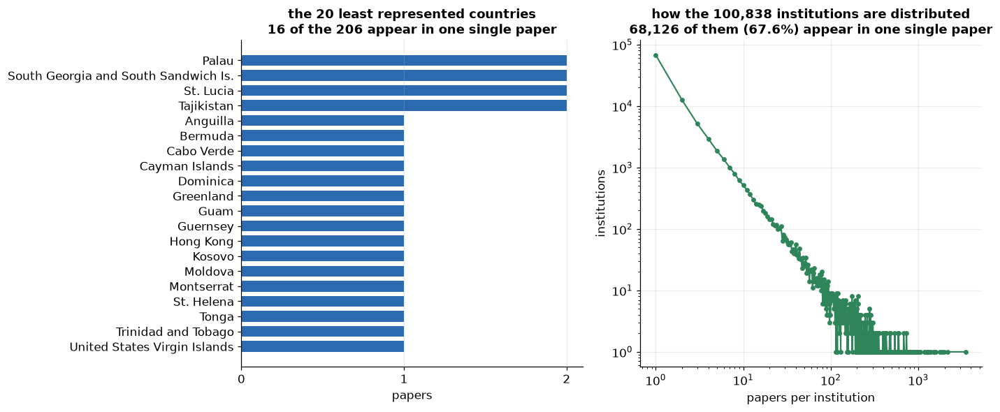
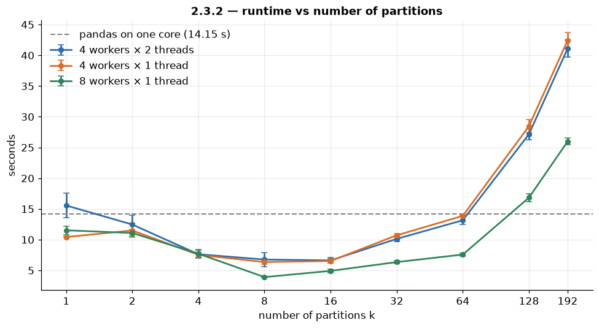
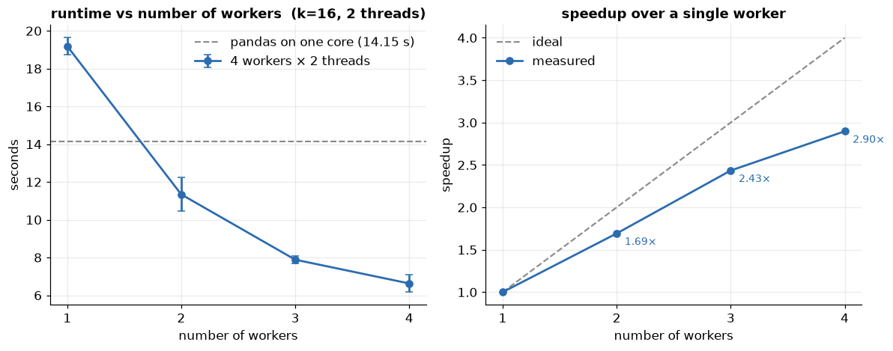
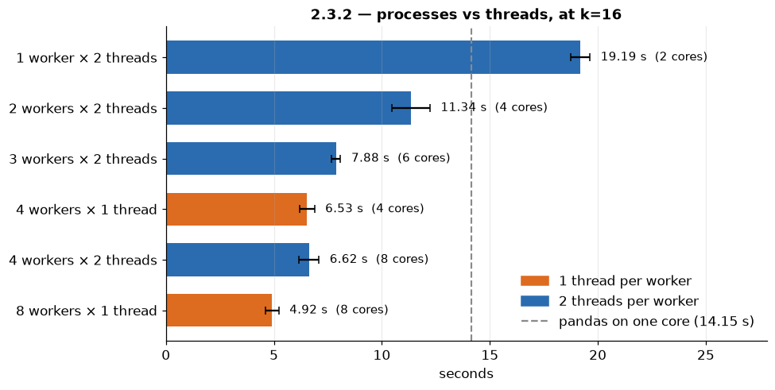

# Affiliations speech · 5-minute version

The details for the questions are in `affiliations_speech.md`. The plots come from `Federico/result_analysis_affiliations.ipynb`, and the flowchart from `affiliations_flow.mmd`. Timings assume a calm pace (~130 words per minute).

## 1 · How the code works  (≈ 2 min)

Task 2.3.2 ranks countries and institutions from the authors' affiliations. We read the silver authors table, where one row is one author of one paper, into a Dask DataFrame.

**Partitions.** The table is 192 Parquet files. We group them into k groups, and with `dd.from_map` each group becomes one partition: a worker reads those files and returns a pandas DataFrame with the paper id, the country and the institution. k is the knob of the benchmark, and the default is 8.

**Two counts.** Then, for countries and institutions, `ranking` builds two lazy counts. First a `dropna`: an author without an affiliation doesn't vote. The count per author is just a `value_counts` on the name as it is written. The count per paper is the one we rank by. We map the `chiave` function, which removes symbols at the edges, the leading article, uppercase and accents, so that different spellings of the same institution get the same key. Then `drop_duplicates` on paper and key, so a paper with forty Italian authors counts once for Italy. Then a `value_counts` on the key.

**One compute.** These four Series are computed with a single `dask.compute`, so the files are read only once, and only at this point the workers start working. The results are small, so they come back to the driver, where `classifica` finishes with plain pandas: for each key it keeps the most frequent spelling as the name, with papers and authors side by side. Then it writes a CSV and the top and bottom plots.

## 2 · The result  (≈ 40 s)

The United States lead with about 50,000 papers, then China, the United Kingdom, Italy and Germany, and the first ten countries hold 62% of all the paper–country pairs. Counting papers and not authors changes the answer: by authors, Italy would pass the United Kingdom, because Italian papers have more co-authors.

At the bottom, 16 countries appear in a single paper, and that is a real result. For institutions it isn't: two out of three appear in only one paper, so on the right we show the distribution instead: a few giants and a very long tail.

## 3 · Benchmarks  (≈ 2 min 20 s)

**Setup.** We measured on the cluster: four workers with two cores each, so eight cores. We time only the compute, and we compare everything with the same work done in pandas on one core, which takes 14 seconds. The data are only 34 MB, so the real question is whether distributing is worth it at all.

**Partitions.**

First, the time against the number of partitions. The curve is a U. With few partitions there is not enough work to split: with one partition, a single worker does everything. With many partitions each one is tiny, at k equal 192 about 15,000 rows, and the cost of scheduling a task becomes bigger than the work inside it. The minimum is at k equal 8, our default. One partition per file, the obvious choice, is the worst point: 41 seconds, almost three times slower than pandas.

**Workers.**

Then the time against the number of workers, at k equal 16. Four workers give a speedup of 2.9, not 4, because the shuffles and the coordination of the tasks don't shrink when we add workers. And one worker alone is slower than pandas, so against pandas the real gain is 2.1.

**Processes or threads.**

Last, how to use the eight cores. Start from four workers with one thread each. Giving each worker a second thread changes nothing: 6.5 against 6.6 seconds. Adding four more processes instead brings the time down to 4.9. The reason is the GIL: inside a Python process only one thread at a time runs Python code, and `chiave` is pure Python on every row, so two threads in the same worker just take turns. For this job, the useful unit is the process.

**Bottom line.** Putting it together, eight processes with one thread and k equal 8 take 3.9 seconds, against the 41 of the configuration we started from. Same hardware, same code, ten times faster, and 3.6 times faster than pandas on one core.
