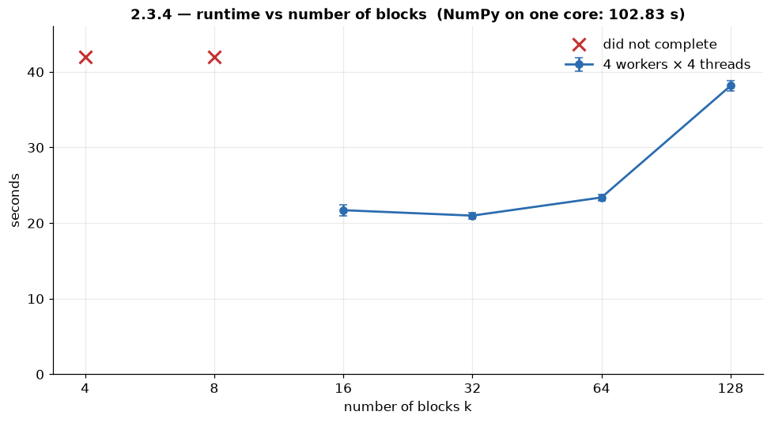
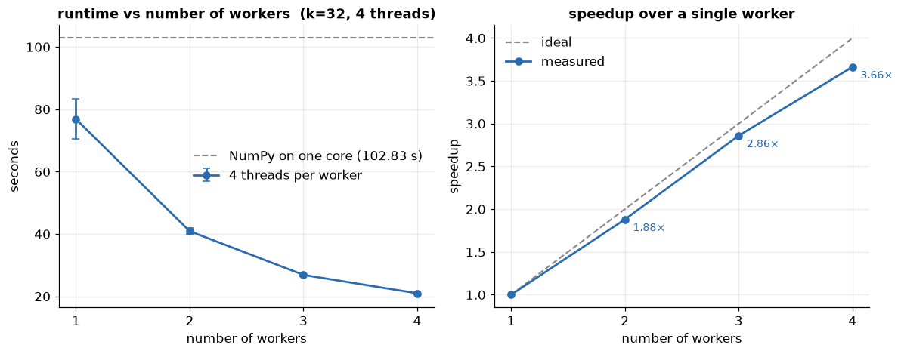
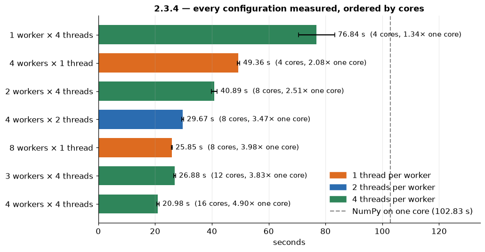
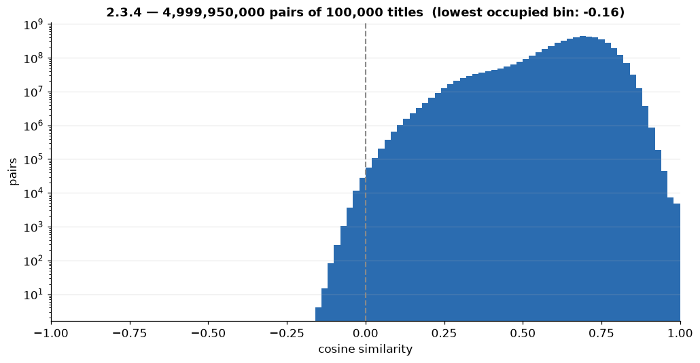

# Cosine similarity speech

*About 5 minutes. The four charts come from `nicco_scripts/result_analysis_cosine.ipynb` and sit next to this file.*

## The idea · ~40 s

The last task asks for the cosine similarity between every pair of titles, using the title vectors from task 2.3.3, to identify the most similar and the most dissimilar papers. Each title is a vector of 300 numbers. The cosine is the dot product divided by the two lengths, so the first move is to normalize every vector once: then both lengths are one, and the cosine is just the dot product. With the normalized vectors as the rows of a matrix X, all the pairs at once are one matrix product, X times X transpose, which NumPy runs in compiled code, not as a Python loop.

**Figure C1 · From cosine similarity to one matrix product**

```text
 cos(a, b) = a · b / (‖a‖ ‖b‖)

 normalize ONCE:   x = a / ‖a‖   →   ‖x‖ = 1   →   cos(a, b) = x · y

        X                   Xᵀ                          S
   N rows × 300    @    300 × N columns    =    N × N matrix
   one row per title                             S[i, j] = cos(title i, title j)
   (normalized)                                  symmetric: S[i, j] = S[j, i]

 X @ X.T  →  NumPy hands it to BLAS (compiled code), not a Python double loop

                    titles      vectors (float32)    S (float32)    pairs
 ───────────────    ────────    ─────────────────    ───────────    ──────────────
 our sample         100,000     120 MB               40 GB          4,999,950,000
 whole corpus       969,021     1.16 GB              3.76 TB        ≈ 4.7 × 10¹¹
```

## The architecture · ~1 min 20 s

The problem is size: the cost grows with the square of the number of titles. On the whole corpus, 969 thousand titles, that's 470 billion pairs, so we work on a fixed sample of 100,000. Even then the vectors are 120 MB, but the full matrix would be 40 GB.

So we cut the rows into k blocks, and the product splits into tiles: tile i, j is block i times block j transpose, and it needs nobody else. The matrix is symmetric, so we only compute the tiles on and above the diagonal. That's a list of independent tasks, so we use `dask.delayed`: as a DataFrame it would be a cross join with billions of rows, and `dask.array` would compute all the tiles. The blocks go to the workers once, with `scatter`.

**Figure C2 · Cutting S into tiles: only the upper half is computed**

```text
 N = 100,000 rows cut into k blocks        (k = 32 → blocks of 3,125 rows)

             block 0    block 1    block 2     …     block k-1
           ┌──────────┬──────────┬──────────┬─────┬──────────┐
 block 0   │  (0,0)   │  (0,1)   │  (0,2)   │  …  │ (0,k-1)  │
           ├──────────┼──────────┼──────────┼─────┼──────────┤
 block 1   │          │  (1,1)   │  (1,2)   │  …  │ (1,k-1)  │
           ├──────────┼──────────┼──────────┼─────┼──────────┤
 block 2   │  mirror  │          │  (2,2)   │  …  │ (2,k-1)  │
           ├──────────┼──────────┼──────────┼─────┼──────────┤
   …       │  of the  │          │          │  …  │    …     │
           ├──────────┼──────────┼──────────┼─────┼──────────┤
 block k-1 │  upper   │          │          │     │(k-1,k-1) │
           └──────────┴──────────┴──────────┴─────┴──────────┘

 tile (i, j) = X[block i] @ X[block j].T            needs nobody else
 only i ≤ j, because S is symmetric   →   k(k+1)/2 tasks
   k = 32  → 528 tasks          k = 128 → 8,256 tasks
 on a diagonal tile only the strict upper triangle: no title paired with itself, no pair counted twice
```

The key point is that the result is bigger than the input, so we never keep it. Each tile reduces in place: it keeps its 20 most similar pairs, its 20 most dissimilar ones and a histogram, and throws the rest away. The final merge is exact: a pair that isn't in the top 20 of its own tile can't be in the global top 20.

**Figure C3 · The graph: many independent tiles, each one reduced in place**

```text
 embeddings/   8 Parquet files · 969,021 titles × 300               on the driver, outside the timer
      │ load_vectors()   a quota from each file, fixed seed → 100,000 titles
      │ normalize()      X / ‖X‖
      ▼
 X   100,000 × 300 · 120 MB
      │ split_rows(N, k)          k contiguous blocks
      │ client.scatter(blocks)    the blocks go to the workers ONCE
      ▼
 ┌────────────────────────── k(k+1)/2 delayed tasks, in parallel ──────────────────────────┐
 │  top_block(block i, block j)                                                            │
 │    S_ij = A @ B.T                  millions of numbers (3,125 × 3,125 at k = 32)        │
 │    clip to [-1, 1]                 float32 can give 1.0000001                           │
 │    histogram, 100 bins                                                                  │
 │    top 20 + bottom 20 pairs        with global row indices                              │
 │    → returns 40 rows + 100 counts; the millions of numbers are thrown away              │
 └─────────────────────────────────────────────────────────────────────────────────────────┘
      │
      ▼
 delayed(merge)       concat the small tables → nlargest(20) · nsmallest(20) · sum of histograms
      │ client.compute(…)                                   ═══ TRIGGER (this is what we time)
      ▼
 driver: row index → cord_uid → title      most_similar.csv · most_dissimilar.csv · histogram.png
 check:  histogram total = N(N−1)/2 = 4,999,950,000 pairs  ✓

 exact, not approximate: the globally most similar pair is necessarily in the top 20 of its own tile

 why delayed
   DataFrame     all pairs = a cross join: billions of rows materialized
   dask.array    X @ X.T in blocks, but all k² tiles: it does not know that S is symmetric
   delayed       the problem as it is: a list of independent tiles
```

## The benchmarks · ~1 min 40 s

We measured on Cloud Veneto: four workers with 4 cores and 8 GB each, six full passes. Plain NumPy on a single core takes about 103 seconds.

First, time against the number of blocks. Here k is also memory: the peak of a tile grows with its side squared, times the threads working together. So at k equal to 4 and 8 the workers get killed. The minimum is at 32, 21 seconds, only 3% better than 16, so we chose 32 because its memory peak is four times lower. At 128 the time almost doubles: with more than 8,000 tasks, the computation no longer pays for the scheduling.

**Figure C4 · The memory wall: k is also the memory peak of every task**

```text
 peak per task ≈ 12–14 × L² bytes,   L = N / k = side of the tile
   (the matrix: 4 bytes per value, plus the int64 indices of argpartition: 8 bytes each)
 × threads per worker, because they compute different tiles at the same time

 100,000 titles
   k      side L    per task    × 4 threads    outcome on the cluster
 ─────   ───────   ─────────   ────────────   ──────────────────────────────────
     4    25,000     7.5 GB        30 GB       ✗ did not complete
     8    12,500     1.9 GB       7.5 GB       ✗ KilledWorker on all four workers
    16     6,250    0.47 GB       1.9 GB       ✓
    32     3,125    0.12 GB      0.47 GB       ✓ default: two steps from the wall
    64     1,562    0.03 GB      0.12 GB       ✓
   128       781   0.007 GB      0.03 GB       ✓ but 8,256 tasks
```

**Figure C5 · Runtime vs number of blocks**



```text
 4 workers × 4 threads · 100,000 titles · 6 passes
 k          4        8        16             32             64             128
 seconds    ✗        ✗        21.70 ± 0.72   20.98 ± 0.44   23.38 ± 0.40   38.16 ± 0.69
            └ memory wall ┘   └───────────── flat ─────────────┘            └ scheduling ┘

 k = 32 vs k = 16:  −3.4% at 2.1 σ     → not decisive
                    memory peak 4× lower → decisive
```

Second, the workers: from 77 seconds with one worker to 21 with four, a speedup of 3.66, and almost 5 times faster than a single core.

**Figure C6 · Runtime and speedup vs number of workers**



```text
 k = 32 · 4 threads per worker · one worker per machine
 workers              1              2              3              4
 cores                4              8              12             16
 seconds              76.84 ± 6.37   40.89 ± 0.97   26.88 ± 0.34   20.98 ± 0.44
 speedup              1.00           1.88           2.86           3.66    (92% efficiency)
 vs NumPy on one core (102.83 s)                                   4.90×

 the one-worker point is the noisiest: a single machine carries all the load
```

The most interesting result is about threads. In the word count and in the affiliations the work is Python code, the GIL lets only one thread at a time run it, and extra threads gave nothing. Here the work is inside BLAS, which releases the GIL: the second thread per worker gives 1.66 times, and on the same 8 cores processes beat threads by only 1.15. And 8 cores on four machines beat 12 cores on three: what scales here is the machine, with its own memory.

**Figure C7 · Every configuration, and processes against threads**



```text
 4 workers, one per machine
 threads per worker     1              2              4
 seconds                49.36 ± 0.44   29.67 ± 0.34   21.16 ± 0.50
 gain                                  1.66×          1.40×

 the clean comparison: same 8 cores, same 4 machines
   8 workers × 1 thread     25.85 ± 0.16 s   ┐
   4 workers × 2 threads    29.67 ± 0.34 s   ┘  processes win by 1.15×

 the three tasks side by side          processes vs threads, same cores   the 2nd thread gives
 ───────────────────────────────────   ────────────────────────────────   ────────────────────
 2.3.1 word count     (Python code)    2.03×                              slows down
 2.3.2 affiliations   (Python code)    1.33×                              1.01× (nothing)
 2.3.4 cosine         (BLAS, no GIL)   1.15×                              1.66×

 8 cores on 4 machines (25.85 s) beat 12 cores on 3 machines (26.88 s)
 efficiency ≈ 50% with 1 thread per worker, ≈ 31% with 4 threads
 → the limit is the memory bandwidth of each machine, shared by its threads
```

## The results · ~1 min 20 s

This is the distribution of all five billion similarities, on a log scale. In theory they go from minus one to one, but almost all the pairs sit between 0.3 and 0.9, and the most dissimilar one is around minus 0.15: vectors of papers on one topic live in a narrow cone, so dissimilar means unrelated, not opposite.

**Figure C8 · The distribution of the 5 billion similarities**



```text
 4,999,950,000 pairs of 100,000 titles · 100 bins over [-1, 1] · log scale
 98.3% of the pairs between 0.3 and 0.9 · peak at 0.68–0.70
 negative pairs: 0.0009% · most dissimilar pair: −0.148 · nothing near −1

 most dissimilar pair
   −0.1475   "HEARTS of athletes."  ||  "Campylobacteriose — eine zoonotische Infektionskrankheit"
```

At the top, the twenty most similar pairs are all exactly 1. Eleven of them are the same paper indexed twice: 28% of the papers have a title that isn't unique. The other nine are titles that the model reduces to the same words, like two German titles where it only knows "der". We have a filter for each case, off by default, because that's an analysis choice. And with both filters on, about 1,900 of the top 5,000 pairs are still at 1: the same paper from two sources, differing by a dot or a dash. So cosine similarity finds the twin papers in the corpus, which is exactly what it's for.

**Figure C9 · What sits at similarity 1.0000**

```text
 the 20 most similar pairs: all exactly 1.0000

 11 × the same paper indexed twice                      28.0% of the papers have a non-unique title
   "3D printing of face shields to meet the immediate need for PPE …"
   "3D Printing of Face Shields to Meet the Immediate Need for PPE …"

  9 × titles collapsed onto the same known words
   "Mitteilungen der DGPPN 9/2020"   ||  "Grundbegriffe der Immunologie"     → the model only knows "der"
   "July 6–12, 2013"                 ||  "July 13–19, 2013"                  → only "july"
   "Case Report Thiaminsubstitution" ||  "Elasomeran: Perimyocarditis: case report"   → "case" + "report"

 filters, off by default (analysis decision)          pairs at 1.000000 among the top 5,000
 ───────────────────────────────────────────          ─────────────────────────────────────
 none                                                  4,131
 --min-parole 2    at least 2 known words              3,357
 --min-parole 3    at least 3 known words              2,932
 --solo-unici      only non-duplicated titles          2,162
 both                                                  1,902   ← none with two identical strings:
                                                                 the same paper from two sources,
                                                                 differing by a final dot or a dash
```
